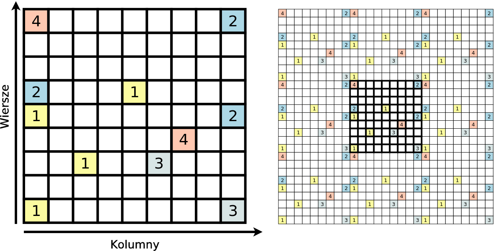
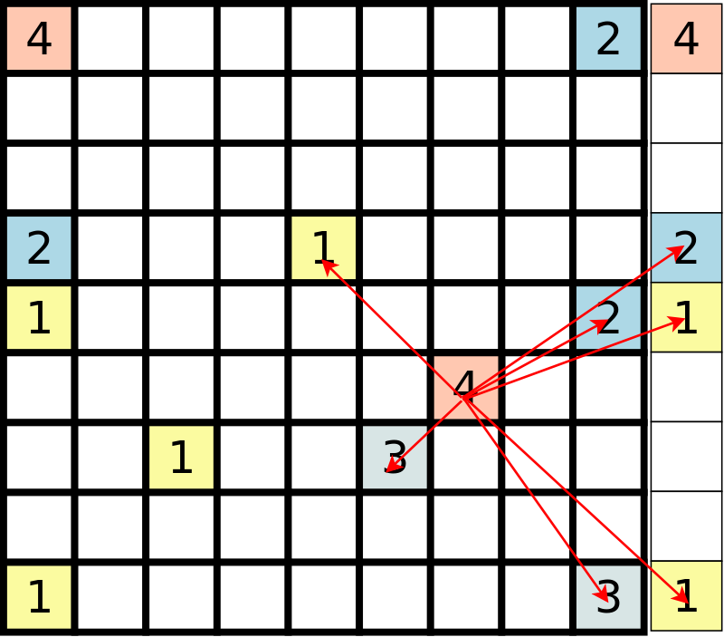
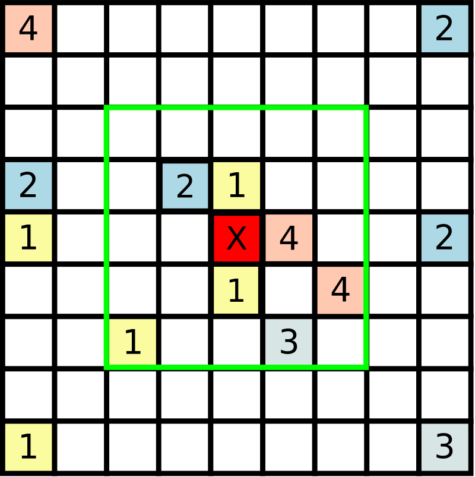

<h3>Zadanie 3.</h3><h4>Idea zadania</h4>

Ponownie trzeba będzie zmierzyć się z kolekcjami. Zadanie polega
na analizie sąsiedztwa obiektów umieszczonych na płaszczyźnie. Aby
zadanie było ciekawsze obliczeń trzeba będzie dokonać z zastosowaniem
periodycznych warunków brzegowych.

<h4>Rys historyczny</h4>

Na początku w pamięci programu niemal niczego nie było. Potem pojawił się liniowy rozmiar płaszczyzny (LRP). 
I oto płaszczyzna powstała. Dla ułatwienia tyle samo kolumn co i wierszy mająca.
A ideksowana liczbami całkowitymi od 1 do LRP. W ten sposób płaszczyznę na pola podzielono. 
Była jednak jałowa i pusta. Smutek płaszczyzny nie trwał jednak długo. Część pól
zajęta została przez Liczby. Też całowite, bo wszak tak prościej. Gdy Liczby rozlokowano na płaszczyźnie
niektóre z nich poczuły się urażone. Zapytały: dlaczego te umieszczone w środku mogą mieć sąsiadów z każdej swej strony, 
a my znajdujące się na brzegu takiej możliwości nie mamy? A co my mamy powiedzieć? - 
krzykneły te w rogach - wszak nasze sąsiedztwo jest jeszcze bardziej ubogie.
Sprawa wydawała się beznadziejna. Chaos narastał. Zaczynały się rękoczyny, przepychanki, te z brzegu szturmować
chciały centrum. Lecz w chwili niemalże ostatniej na białym koniu przybyły
One: Periodyczne Warunki Brzegowe. Odłóżcie widły i pochodnie, my znamy rozwiązanie! - krzyczały -
nie tylko znamy, ale i podzielimy się nim z Wami. A oto i ono: 
płaszczyznę skeić należy tak, aby sąsiadem tego co po prawej jest stronie stał się ten,
co jest po lewej, a górnego odpowienio dolny. Tak oto płaszczyzna przybierze kształ torusa i każdy znajdzie
sąsiada swego i samotny już nie będzie. Tako rzekłyśmy my Perdiodyczne Warunki Brzegowe, a co uczynicie 
Waszą jest sprawą.

Liczby ochłoneły - rada PWB za dobrą się im zdała. Płaszczyznę połączono i tak oto szczęście zagościło na Płaszyżnie
po wsze czasy, a przynajmniej do końca pracy programu...

<h4>Periodyczne warunki brzegowe</h4>

Idea PWB jest prosta i pozwala unikać brzegu. Kolejna kolumna na prawo od ostatniej to ponownie pierwsza.
Kolejna kolumna na lewo od pierwszej to ostatnia. Podobnie z wierszami. Najprościej rzecz sobie rozrysować dodając dodatkowe
płaszczyzny tak jak na obrazku poniżej. Obrazek pozwala także ustalić sąsiadów pól znajdujących się na rogach.

 

<h4>Zadanie</h4>

W zadaniu trzeba ustalić sąsiedztwa wskazanych pól. Sąsiedztwa analizowane są w funkcji odległości od 
punktu, dla którego sąsiadów liczymy. Aby uniknąć liczb rzeczywistych stosować będziemy
tak naprawdę kwadrat odległości, bo wtedy nie trzeba używać pierwiastka:

<pre>pozycja A kolumna 2, wiersz 3
pozycja B kolumna 3, wiersz 5

kwadrat odległości A-B = (2-3)^2 + (3-5)^2 = 1 + 2^2 = 5 
odległość A-B = sqrt( 5 ) = 2.236068 
</pre>

Przykład wyznaczania odległości:

Licząc od liczby 4 mamy następujące kwadraty odległości (o ile się nie pomyliłem):

<ul>
<li>Najbliższe 3: 1+1 = 2
</li><li>Bliższe 2: 2^2 + 1 = 5
</li><li>Po lewej 1: 2^2 + 2^2 = 8
</li><li>1 na prawo, powyżej: 3^2 + 1 = 10
</li><li>Kolejne 2: 3^2 + 2^2 = 9+4 = 13
</li><li>3 na prawo, poniżej: 2^2 + 3^2 = 13
</li><li>1 na prawo, poniżej: 3^2 + 3^2 = 18
</li></ul>

Część liczb (2,1,1) dodałem ze względu na periodyczne warunki brzegowe.

Przykład wyniku

Obliczenia prowadzimy względem pozycji oznaczonej czerwonym polem X. 
Maksymalny kwadrat odległości to 8.

Mamy następujących sąsiadów:

<ul>
<li>W kwadracie odległości 1: 2x1 i 1x4
</li><li>W kwadracie odległości 2: 1x2
</li><li>W kwadracie odległości 5: 1x3 i 1x4
</li><li>W kwadracie odległości 8: 1x1
</li></ul>

Wynikiem jest więc następująca mapa:

<pre>1 -&gt; [ 1 -&gt; 2, 8 -&gt; 1 ]  (liczba 1, w kwadracie odległości 1 dwie sztuki, w kwadracie odległości 8 jedna)
2 -&gt; [ 2 -&gt; 1 ]          (liczba 2 występuje tylko w kwadracie odległości 2 jeden raz)
3 -&gt; [ 5 -&gt; 1 ]          (liczba 3 występuje tylko w kwadracie odległości 5 jeden raz)
4 -&gt; [ 1 -&gt; 1, 5 -&gt; 1 ]  (liczba 4, w kwadracie odległości 1 jedna sztuka, w kwadracie odległości 5 też jedna)
</pre>

<h4>Dostarczanie rozwiązania</h4>

Proszę o dostarczenie kodu <b>źródłowego</b> klasy <code class="expectedclass">NumberStatistics</code>.
W klasie można umieścić własne metody i pola. Klasa 
ma implementować interfejs <code>Statistics</code>.

