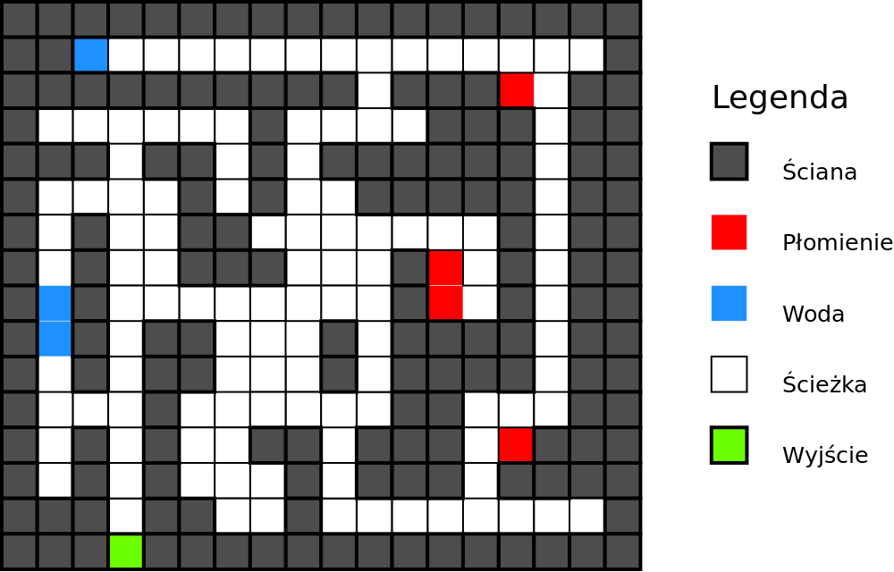

<h3>Zadanie 4</h3><h4>Idea zadania</h4>

Odszukać wyjście z nieznanego labiryntu. Generalnie: przetrwać!
Jeśli chodzi o język Java to pojawią się typ wyliczeniowy oraz wyjątki.

<h4>Na czym polega problem?</h4>

Rozpoczynamy wędrówkę po nieznanym labiryncie. Labirynt posiada wiele dróg i niebezpiecznych miejsc
rozmieszczonych na jednym poziomie planszy do gry. Plansza podzielona jest na kwadratowe pola o tym samym rozmiarze.
Niektóre z dróg są ślepe. Są i takie, które wprowadzają pętle. Są miejsca, w których się pali. Są 
również pola zalane wodą. Łatwo nie będzie...

Przykładowy labirynt pokazano na obrazku poniżej.

<h4>Sterowanie</h4>

Ruchem gracza steruje się za pomocą metody <code>move()</code>. Przekazuje się do niej informację o kierunku
ruchu.

<h4>Informacja zwrotna</h4>

Metoda <code>move()</code> zwraca informacje dodatkowe poprzez wyjątki. 
Trzeba je obsłużyć, bo tylko tak można dowiedzieć&nbsp;się o tym co zaszło na planszy.

<h4>Przegrana</h4>

Powody porażki:

<ul>
<li>Nie zostanie znalezione wyjście. Czas poszukiwań będzie ograniczony, jednak limit będzie na tyle 
duży, aby poprawnie działający program nie miał problemu ze znalezieniem rozwiązania.</li>
<li>Ponowne uderzenie w tą samą przeszkodę. Informacje o położeniu ścian trzeba zapamiętywać.
Ponowne uderzenie w tą samą przeszkodę (z dowolnego kierunku) prowadzi do dyskwalifikacji gracza.
</li><li>Ponowne wejście do tego samego do płonącego pomieszczenia - podobnie, z dowolnego kierunku.
</li><li>Pozostawanie w płonącym pomieszczeniu. Wejście do płomieni musi prowadzić do natychmiastowej
ucieczki. Jeśli np. do płonącego pomieszczenia dotarliśmy idąc na północ, to następnym ruchem musi być
ruch na południe.
</li><li>Pozostawanie zbyt długo pod wodą. Gra pozwala na przebycie kilku pól pod wodą, ale
wykonanie zbyt wiele razy <code>move()</code> w trakcie pozostawania cały czas pod wodą (bez wynurzenia) prowadzi do
porażki.</li>
<li>Wykonanie kolejnego (dowolnego) ruchu po odnalezieniu wyjścia.
</li></ul>

<h4>Sterowanie</h4>

Najpierw Państwa program otrzyma ode mnie informacje o liczbie dozwolonych ruchów (kroków)
pod wodą i kontroler. Następnie wykonana zostanie metoda <code>findExit</code>.
Od tej chwili Państwa program rozpoczyna poszukiwania wyjścia. Metoda
<code>findExit</code> ma zakończyć się po szczęśliwym odnalezieniu wyjścia (przechwyceniu wyjątku Exit).

<h4>Dla ułatwienia</h4>

Woda może pojawić się tylko na prostym odcinku korytarza o szerokości jednego pola.

<h4>Dostarczanie rozwiązania</h4>

Proszę o dostarczenie kodu <b>źródłowego</b> klasy <code class="expectedclass">Indiana</code>.
W klasie można umieścić własne metody i pola. Klasa 
ma implementować interfejs <code>Explorer</code>.

<h4>Dodatek</h4>

Dodałem rekord <code>Position</code>, który używany jest przez typ wyliczeniowy <code>Direction</code>.
Można zastosować we własnym rozwiązaniu. Można i nie stosować.

