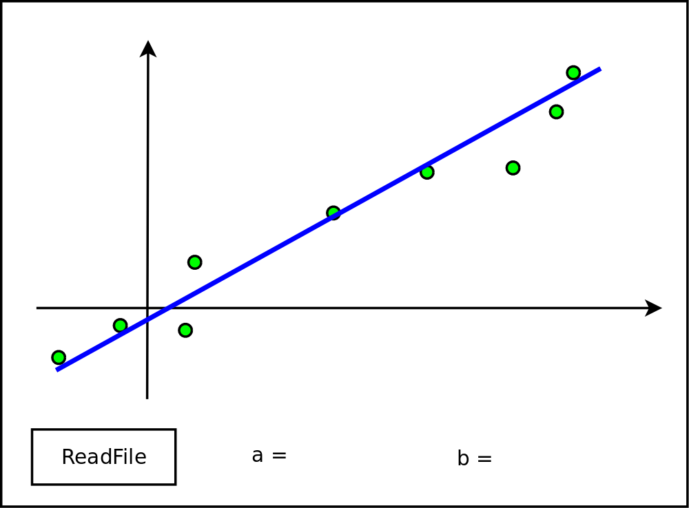

<h3>Zadanie 09 termin IV. Do zdobycia maksymalnie: 0,7pkt.</h3><h4>Idea zadania</h4>

Program liczący regresję liniową z prostym interfejsem graficznym.

<h4>Co trzeba zrobić.</h4>

Zadanie polega tym razem na napisaniu kompletnej aplikacji w Java. 
Po uruchomieniu programu powinno wyświetlić się na ekranie okienko.
Przycisk powinien pozwalać na wybór pliku (JFileChooser).
Wybranie pliku powinno doprowadzić do jego załadowania.

Dane będą zapisane w pliku tekstowym o prostym formacie.

<pre>5
-1.2 -1.6
1.4 3.4
1.7 7.3
2.2 15.4
3.3 23.2
</pre>

Pierwsza linia to liczba danych. W każdej kolejnej linijce para liczb rzeczywistych (kolejne współrzędne x i y punktów "doświadczalnych").
Zakładamy, że dane będą zawierać zarówno liczby dodatnie, jak i ujemne.

<h6>Regresja liniowa</h6>

Do zgromadzonych w pliku danych należy dopasować prostą. Współczynniki 
"b" (współczynnik kierunkowy prostej) i "a" (wyraz wolny) proszę wyliczyć 
na podstawie wzorów (53) znajdujących się na stronie 29 
<a href="https://1pf.if.uj.edu.pl/c/document_library/get_file?uuid=36addbf8-fc9c-4c14-a823-1788a77a7793&amp;groupId=5046939">WSTĘPu DO ANALIZY I REDUKCJI DANYCH DOŚWIADCZALNYCH</a>. Uwaga: prosta przechodząca przez punkty ma wzór: y = bx + a (wzór 43 strona 26).

<h6>Wykres</h6>

I teraz najważniejsze. Program ma wyświetlić wykres zawierający osie współrzędnych,
punkty i dopasowaną prostą. Wartości liczbowe współczynników mają się również pojawić.

Wykres musi:

<ul>
<li>Wyświetlić się automatycznie zaraz po załadowaniu i przetworzeniu danych z pliku.
</li><li>Zajmować największą część okna.
</li><li>Skalować się poprawnie wraz ze zmianami rozmiaru okna (zmiany rozmiaru okna nie wolno zablokować).
Skalowanie w osi poziomej i pionowej ma działać niezależnie. Czyli, odległość (na ekranie) pomiędzy
punktami (0,0) i (1.0) może być inna (w pikselach) niż pomiędzy (0,0) a (0,1). Najważniejsze jest to, aby
wykres najmował całą, przeznaczoną dla niego część okna (oczywiście z rozsądnymi marginesami).
</li><li>Tak być narysowany, aby punkty i prosta pasowały do umiejscowienia osi współrzędnych.
</li><li>Używać punktów o rozmiarze łatwym do zobaczenia na ekranie.
</li><li>Rysować punkty jako koła (nie elipsy).
</li><li>

<h4>Idea wyglądu aplikacji: </h4>

Schemat wyglądu aplikacji zawiera poniższy obrazek:

<h4>Kolejne pliki</h4>

Jednorazowe uruchomienie programu musi pozwolić na przetworzenie przez niego wielu plików.

<h4>Dostarczanie rozwiązania</h4>

Program ma dać się uruchomić za pomocą polecenia: java Start

</li></ul>
